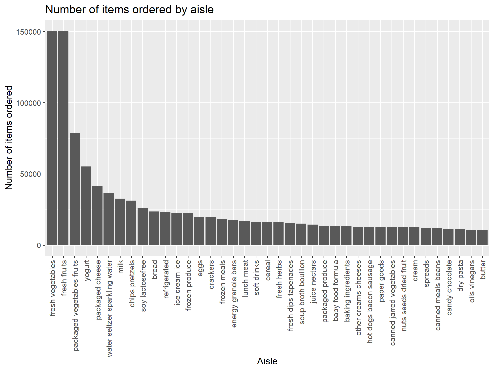

p8105_hw3_sx2402
================
Eric Xu
2025-10-04

## Problem 1:

``` r
instacart_skim = instacart |> 
  mutate(
    user_id = as.character(user_id),
    aisle_id = as.character(aisle_id),
    reordered = as.factor(reordered),
    order_id = as.character(order_id),
    product_id = as.character(product_id),
    department_id = as.character(department_id)
         )

names(instacart_skim)
skimr::skim(instacart_skim)
```

There are 1384617 observations from dataset `instacart` and 131,209
unique users. Each row represents a single product in a customer’s
order. There are in total 39123 unique product names. There are total 15
variables, 5 describing identifiers of order, aisle, product,
department, and user; and `add_to_cart_order` shows order in which each
product was added to cart.

Some other important variables include:

- `redordered`: if this product has been ordered by this user in the
  past
- `order_number`: the order sequence number for this user (1=first,
  n=nth)
- `order_dow`: the day of the week on which the order was placed
- `order_hour_of_day`: the hour of the day on which the order was placed
- `days_since_prior_order`: days since the last order, capped at 30, NA
  if order_number is 1

### Questions:

**How many aisles are there, and which aisles are the most items ordered
from?**

``` r
instacart_skim = instacart |> 
  summarize(
    n_aisle = n_distinct(aisle),
    n_obs = n()
    )
instacart_skim
## # A tibble: 1 × 2
##   n_aisle   n_obs
##     <int>   <int>
## 1     134 1384617

instacart_skim = instacart |>
  group_by(aisle) |> 
  count(aisle, name = "n_times") |> 
  arrange(desc(n_times))
instacart_skim
## # A tibble: 134 × 2
## # Groups:   aisle [134]
##    aisle                         n_times
##    <chr>                           <int>
##  1 fresh vegetables               150609
##  2 fresh fruits                   150473
##  3 packaged vegetables fruits      78493
##  4 yogurt                          55240
##  5 packaged cheese                 41699
##  6 water seltzer sparkling water   36617
##  7 milk                            32644
##  8 chips pretzels                  31269
##  9 soy lactosefree                 26240
## 10 bread                           23635
## # ℹ 124 more rows
```

*There are 134 unique aisles and aisle `fresh vegetables` occurred
150609 times with the the most items ordered from*

**Make a plot that shows the number of items ordered in each aisle,
limiting this to aisles with more than 10000 items ordered. Arrange
aisles sensibly, and organize your plot so others can read it.**

``` r
aisle_counts = instacart |> 
  count(aisle, name = "n_times") |> 
  filter(n_times > 10000)

aisle_counts |> 
  mutate(aisle = fct_reorder(aisle, -n_times)) |> 
  ggplot(aes(x = aisle, y = n_times)) +
  geom_bar(stat = "identity")+
   viridis::scale_color_viridis()+
  theme(axis.text.x = element_text(angle=90, size=9, hjust=1, vjust=0.5))+
  labs(
    title = "Number of items ordered by aisle",
    x = "Aisle",
    y = "Number of items ordered"
  )
```



**Make a table showing the three most popular items in each of the
aisles “baking ingredients”, “dog food care”, and “packaged vegetables
fruits”. Include the number of times each item is ordered in your
table.**

``` r
top_items = instacart |> 
  filter(aisle %in% c("baking ingredients", "dog food care", "packaged vegetables fruits")) |> 
  count(aisle,product_name, name = "times") |>
  group_by(aisle) |> 
  arrange(desc(times)) |> 
  slice_max(times, n =3)
knitr::kable(top_items)
```

| aisle | product_name | times |
|:---|:---|---:|
| baking ingredients | Light Brown Sugar | 499 |
| baking ingredients | Pure Baking Soda | 387 |
| baking ingredients | Cane Sugar | 336 |
| dog food care | Snack Sticks Chicken & Rice Recipe Dog Treats | 30 |
| dog food care | Organix Chicken & Brown Rice Recipe | 28 |
| dog food care | Small Dog Biscuits | 26 |
| packaged vegetables fruits | Organic Baby Spinach | 9784 |
| packaged vegetables fruits | Organic Raspberries | 5546 |
| packaged vegetables fruits | Organic Blueberries | 4966 |

**Make a table showing the mean hour of the day at which Pink Lady
Apples and Coffee Ice Cream are ordered on each day of the week; format
this table for human readers (i.e. produce a 2 x 7 table).**

``` r
mean_hours = instacart |> 
  filter(product_name %in% c("Pink Lady Apples", "Coffee Ice Cream")) |> 
  group_by(product_name, order_dow) |> 
  summarize(
    mean_hour = mean(order_hour_of_day)
    ) |> 
  mutate(order_dow = case_when(
    order_dow == 0 ~ "Sunday",
    order_dow == 1 ~ "Monday",
    order_dow == 2 ~ "Tuesday",
    order_dow == 3 ~ "Wednesday",
    order_dow == 4 ~ "Thursday",
    order_dow == 5 ~ "Friday",
    order_dow == 6 ~ "Saturday"
  )) |> 
  pivot_wider(names_from = order_dow, values_from = mean_hour) |> 
  rename("Product Name" = "product_name")
```

    ## `summarise()` has grouped output by 'product_name'. You can override using the
    ## `.groups` argument.

``` r
knitr::kable(mean_hours, digits = 2)
```

| Product Name     | Sunday | Monday | Tuesday | Wednesday | Thursday | Friday | Saturday |
|:-----------------|-------:|-------:|--------:|----------:|---------:|-------:|---------:|
| Coffee Ice Cream |  13.77 |  14.32 |   15.38 |     15.32 |    15.22 |  12.26 |    13.83 |
| Pink Lady Apples |  13.44 |  11.36 |   11.70 |     14.25 |    11.55 |  12.78 |    11.94 |

## Problem 2
