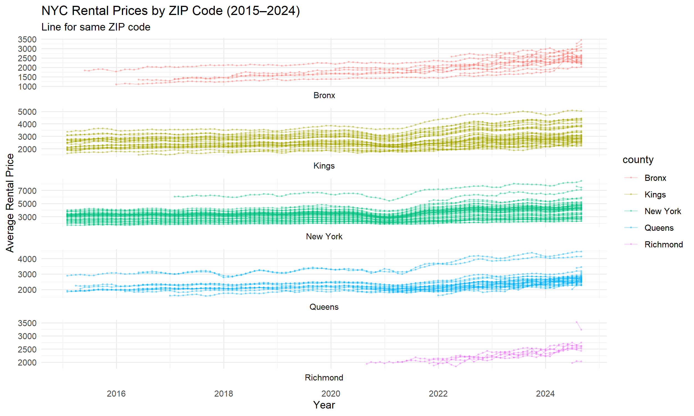
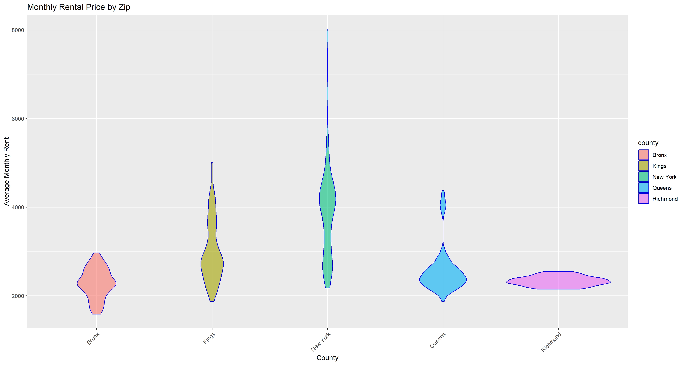
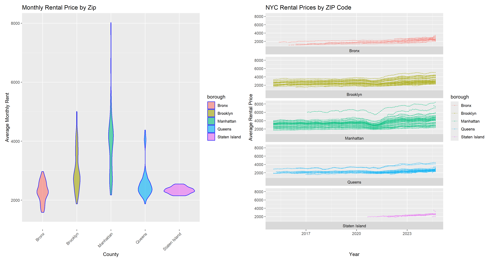

p8105_hw3_sx2402
================
Eric Xu
2025-10-04

## Problem 1:

``` r
instacart_skim = instacart |> 
  mutate(
    user_id = as.character(user_id),
    aisle_id = as.character(aisle_id),
    reordered = as.factor(reordered),
    order_id = as.character(order_id),
    product_id = as.character(product_id),
    department_id = as.character(department_id)
         )

names(instacart_skim)
skimr::skim(instacart_skim)
```

There are 1384617 observations from dataset `instacart` and 131,209
unique users. Each row represents a single product in a customer’s
order. There are in total 39123 unique product names. There are total 15
variables, 5 describing identifiers of order, aisle, product,
department, and user; and `add_to_cart_order` shows order in which each
product was added to cart.

Some other important variables include:

- `redordered`: if this product has been ordered by this user in the
  past
- `order_number`: the order sequence number for this user (1=first,
  n=nth)
- `order_dow`: the day of the week on which the order was placed
- `order_hour_of_day`: the hour of the day on which the order was placed
- `days_since_prior_order`: days since the last order, capped at 30, NA
  if order_number is 1

### Questions:

**How many aisles are there, and which aisles are the most items ordered
from?**

``` r
instacart_skim = instacart |> 
  summarize(
    n_aisle = n_distinct(aisle),
    n_obs = n()
    )
instacart_skim
## # A tibble: 1 × 2
##   n_aisle   n_obs
##     <int>   <int>
## 1     134 1384617

instacart_skim = instacart |>
  group_by(aisle) |> 
  count(aisle, name = "n_times") |> 
  arrange(desc(n_times))
instacart_skim
## # A tibble: 134 × 2
## # Groups:   aisle [134]
##    aisle                         n_times
##    <chr>                           <int>
##  1 fresh vegetables               150609
##  2 fresh fruits                   150473
##  3 packaged vegetables fruits      78493
##  4 yogurt                          55240
##  5 packaged cheese                 41699
##  6 water seltzer sparkling water   36617
##  7 milk                            32644
##  8 chips pretzels                  31269
##  9 soy lactosefree                 26240
## 10 bread                           23635
## # ℹ 124 more rows
```

*There are 134 unique aisles and aisle `fresh vegetables` occurred
150609 times with the the most items ordered from*

**Make a plot that shows the number of items ordered in each aisle,
limiting this to aisles with more than 10000 items ordered. Arrange
aisles sensibly, and organize your plot so others can read it.**

``` r
aisle_counts = instacart |> 
  count(aisle, name = "n_times") |> 
  filter(n_times > 10000)

aisle_counts |> 
  mutate(aisle = fct_reorder(aisle, -n_times)) |> 
  ggplot(aes(x = aisle, y = n_times)) +
  geom_bar(stat = "identity")+
   viridis::scale_color_viridis()+
  theme(axis.text.x = element_text(angle=90, size=9, hjust=1, vjust=0.5))+
  labs(
    title = "Number of items ordered by aisle",
    x = "Aisle",
    y = "Number of items ordered"
  )
```

<!-- -->

**Make a table showing the three most popular items in each of the
aisles “baking ingredients”, “dog food care”, and “packaged vegetables
fruits”. Include the number of times each item is ordered in your
table.**

``` r
top_items = instacart |> 
  filter(aisle %in% c("baking ingredients", "dog food care", "packaged vegetables fruits")) |> 
  count(aisle,product_name, name = "times") |>
  group_by(aisle) |> 
  arrange(desc(times)) |> 
  slice_max(times, n =3)
knitr::kable(top_items)
```

| aisle | product_name | times |
|:---|:---|---:|
| baking ingredients | Light Brown Sugar | 499 |
| baking ingredients | Pure Baking Soda | 387 |
| baking ingredients | Cane Sugar | 336 |
| dog food care | Snack Sticks Chicken & Rice Recipe Dog Treats | 30 |
| dog food care | Organix Chicken & Brown Rice Recipe | 28 |
| dog food care | Small Dog Biscuits | 26 |
| packaged vegetables fruits | Organic Baby Spinach | 9784 |
| packaged vegetables fruits | Organic Raspberries | 5546 |
| packaged vegetables fruits | Organic Blueberries | 4966 |

**Make a table showing the mean hour of the day at which Pink Lady
Apples and Coffee Ice Cream are ordered on each day of the week; format
this table for human readers (i.e. produce a 2 x 7 table).**

``` r
#extract and DOW transform
mean_hours = instacart |> 
  filter(product_name %in% c("Pink Lady Apples", "Coffee Ice Cream")) |> 
  group_by(product_name,order_dow) |> 
  summarize(
    mean_hour = mean(order_hour_of_day)
    ) |> 
  mutate(order_dow = case_when(
    order_dow == 0 ~ "Sunday",
    order_dow == 1 ~ "Monday",
    order_dow == 2 ~ "Tuesday",
    order_dow == 3 ~ "Wednesday",
    order_dow == 4 ~ "Thursday",
    order_dow == 5 ~ "Friday",
    order_dow == 6 ~ "Saturday"
  )) |> 
  pivot_wider(names_from = order_dow, values_from = mean_hour) |> 
  rename("Product Name" = "product_name")


knitr::kable(mean_hours, digits = 2)
```

| Product Name     | Sunday | Monday | Tuesday | Wednesday | Thursday | Friday | Saturday |
|:-----------------|-------:|-------:|--------:|----------:|---------:|-------:|---------:|
| Coffee Ice Cream |  13.77 |  14.32 |   15.38 |     15.32 |    15.22 |  12.26 |    13.83 |
| Pink Lady Apples |  13.44 |  11.36 |   11.70 |     14.25 |    11.55 |  12.78 |    11.94 |

## Problem 2

**Import Dataset**

``` r
zip_code = read_csv("./Data/Zip Codes.csv") |> 
  janitor::clean_names() |> 
  select(-file_date)

zori = read.csv("./Data/Zip_zori_uc_sfrcondomfr_sm_month_NYC.csv") |> 
  janitor::clean_names() |> 
  filter(region_type == "zip")|> 
  rename(
    zip_code = region_name,
    zori_county = county_name
         )|> 
  select(-region_type)

zori_long = zori |> 
  pivot_longer(x2015_01_31:x2024_08_31,
               names_to = "date",
               values_to = "zori",
               names_prefix = "x",
               )
zori_zip = left_join(zori_long,zip_code,by="zip_code",relationship = "many-to-many")
```

**How many ZIP codes are observed 116 times? How many are observed fewer
than 10 times? Why are some ZIP codes are observed rarely and others
observed in each month?**

``` r
zip_counts = zori_zip |> 
  filter(is.na(zori) == FALSE) |> 
  group_by(zip_code) |> 
  summarize(
    n_obs = n()
    )|> 
  filter (n_obs == 116 | n_obs<10)

#count
zip_counts |> 
  summarize(
    count1 = sum(n_obs == 116),
    count2 = sum(n_obs < 10)
  ) 
## # A tibble: 1 × 2
##   count1 count2
##    <int>  <int>
## 1     47     26

#filter obs
zori_counts = left_join(zip_counts,zori_zip, by = "zip_code") |> 
  filter(n_obs < 10 | n_obs == 116) |> 
  group_by(zip_code) |> 
  arrange(n_obs) |> 
  distinct(zip_code, zori_county, n_obs)
zori_counts
## # A tibble: 73 × 3
## # Groups:   zip_code [73]
##    zip_code zori_county     n_obs
##       <dbl> <chr>           <int>
##  1    10453 Bronx County        1
##  2    10470 Bronx County        1
##  3    11366 Queens County       1
##  4    11369 Queens County       1
##  5    11426 Queens County       1
##  6    11693 Queens County       1
##  7    10162 New York County     2
##  8    10303 Richmond County     2
##  9    10459 Bronx County        2
## 10    10460 Bronx County        2
## # ℹ 63 more rows
```

There are 47 ZIP codes observed 116 times and 26 fewer than 10 times.
The counties has little observation are relatively distinct and is
likely to be not rental or not residential so that not enough
observation and data can be collected through rental pricing. While the
zip codes observed every month are in majority of New York County and
Queens where rental is a general option and data is collected easity
with large amount of rental deals.

**Create a reader-friendly table showing the average rental price in
each borough and year (not month). Comment on trends in this table.**

``` r
#date to year
zori_zip_table = zori_zip |> 
  filter(!is.na(zori)) |> 
  mutate(
    date = as.Date(date, format = "%Y_%m_%d"),
    year = year(date)
  )

#average price
zori_zip_table = zori_zip_table |>  
  group_by(county, year) |> 
  summarize(
    avg_rent = mean(zori, na.rm = TRUE)
  ) |> 
  pivot_wider(
    names_from = year,
    values_from = avg_rent
  )


knitr::kable(zori_zip_table, caption = "Average Rental Price by Borough and Year (NYC)")
```

| county | 2015 | 2016 | 2017 | 2018 | 2019 | 2020 | 2021 | 2022 | 2023 | 2024 |
|:---|---:|---:|---:|---:|---:|---:|---:|---:|---:|---:|
| Bronx | 1759.595 | 1520.194 | 1543.599 | 1639.430 | 1705.589 | 1811.443 | 1857.777 | 2054.267 | 2285.459 | 2496.896 |
| Kings | 2492.928 | 2520.357 | 2545.828 | 2547.291 | 2630.504 | 2555.051 | 2549.890 | 2868.199 | 3015.184 | 3125.657 |
| New York | 3006.291 | 3014.570 | 3109.104 | 3159.668 | 3285.334 | 3091.327 | 3124.336 | 3753.080 | 3908.215 | 4052.805 |
| Queens | 2214.707 | 2271.955 | 2263.303 | 2291.918 | 2387.816 | 2315.632 | 2210.787 | 2406.038 | 2561.615 | 2693.584 |
| Richmond | NA | NA | NA | NA | NA | 1977.608 | 2045.430 | 2147.436 | 2332.934 | 2536.442 |

Average Rental Price by Borough and Year (NYC)

``` r
#check NA in Richmond
zori_zip |> 
  filter(
    county == "Richmond",
    !is.na(zori)
  ) |> 
  summarize(
    mindate = min(date),
    maxdate = max(date)
  )
```

    ## # A tibble: 1 × 2
    ##   mindate    maxdate   
    ##   <chr>      <chr>     
    ## 1 2020_08_31 2024_08_31

**Plotting Rental Prices within ZIP**

``` r
zori_zip_plot = zori_zip|> 
  mutate(
    date = as.Date(date, format = "%Y_%m_%d"),
    year = year(date)
         ) |> 
  select(zori, year, county,zip_code,date) |> 
  drop_na(zori)
zori_zip_plot_p =
  ggplot(zori_zip_plot,aes(x = date, y = zori, group = zip_code, color = county, na.rm = TRUE)) +
  geom_point(alpha = 0.4, size = 0.4)  +
  geom_line(alpha = 0.4, linewidth = 0.4)+
  facet_wrap(~ county, strip.position = "bottom", ncol = 1, nrow=5)+
  labs(
    title = "NYC Rental Prices by ZIP Code",
    x = "Year",
    y = "Average Rental Price")+
  scale_x_date(date_breaks = "3 years", date_labels = "%Y")
zori_zip_plot_p
```

<!-- -->

NYC rental prices have generally increased across all boroughs from 2015
to 2024, with a sharp drop in 2021 that aligns with the COVID-19 which
has impacted demand. After the pandemic, prices restored to original
place and continued to rise. Manhattan (New York County) consistently
has the highest rental levels and most available records zip codes,
while Brooklyn (Kings County) follows with moderately high prices.
Queens and the Bronx show lower but steadily increasing rents, and
Richmond (Staten Island) appears later in the data, after 2021, with
comparatively lower rental prices.

**Average Rental Price within each ZIP Plot**

``` r
zori_2023 = zori_zip |>
  mutate(
    date = as.Date(date, format = "%Y_%m_%d"),
    year = year(date),
    month = month(date)
    )|> 
  filter(year == 2023) |> 
  group_by(zip_code, county, month) |> 
  summarize(
    avg_rent = mean(zori, na.rm = TRUE),
    .groups = "drop"
  )

zori_2023_p = ggplot(zori_2023, aes(x = county, y = avg_rent)) +
  geom_violin(alpha = 0.6, aes(fill = county),color = "blue", na.rm = TRUE)+
  labs(
    title = "Monthly Rental Price by Zip",
    x = "County",
    y = "Average Monthly Rent"
  ) +
    theme(axis.text.x = element_text(angle = 45, hjust = 1))
zori_2023_p
```

<!-- -->

``` r
combined_plot =
  (zori_2023_p | zori_zip_plot_p)
combined_plot
```

<!-- -->

``` r
ggsave(filename = "./result/combined.png",plot = combined_plot, width = 15, height = 8, dpi = 300)
```

Manhattan (New York County) shows the highest average rental prices with
wide distribution with highest variation to 8000. Indicating both very
expensive priced max rental price and high minimum rental price among
all ZIP codes within the county. Brooklyn (Kings County) and Queens
follows, also with a narrower distribution generally lower than
Manhattan but higher than others. Richmond and the Bronx display lower
median rents and Richmond (Staten Island) has the narrowest
distribution, reflecting relatively limited variation due to little
sample.

## Problem 3
