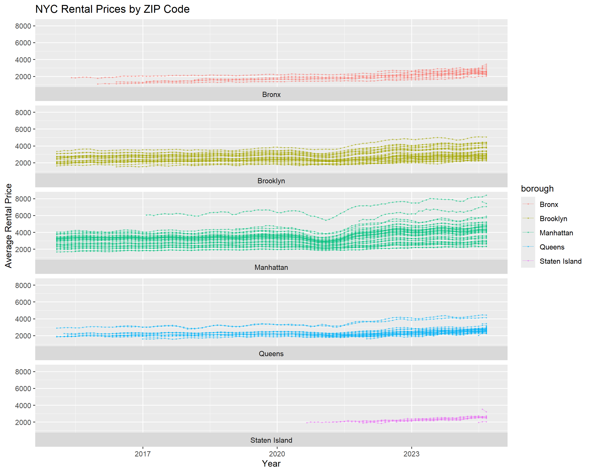
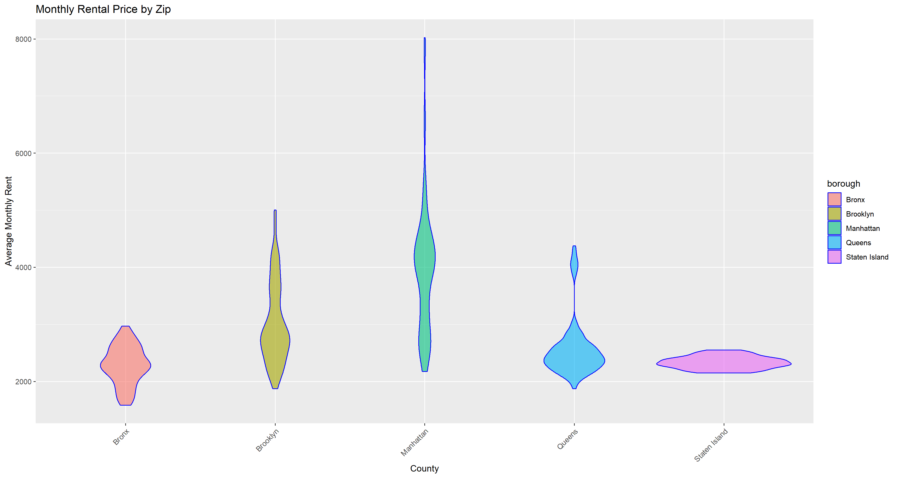
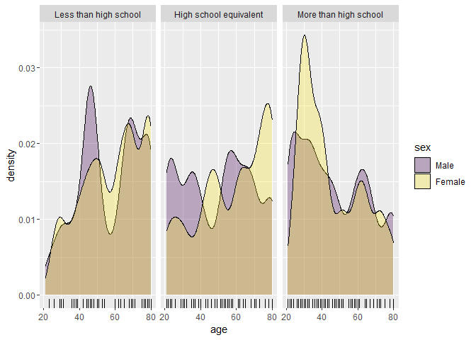
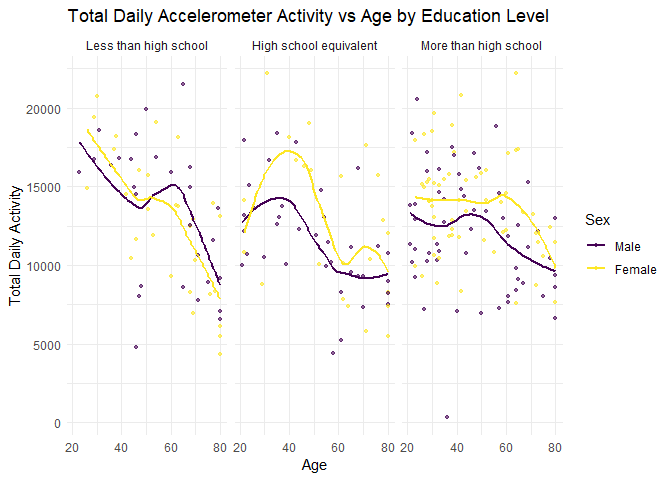
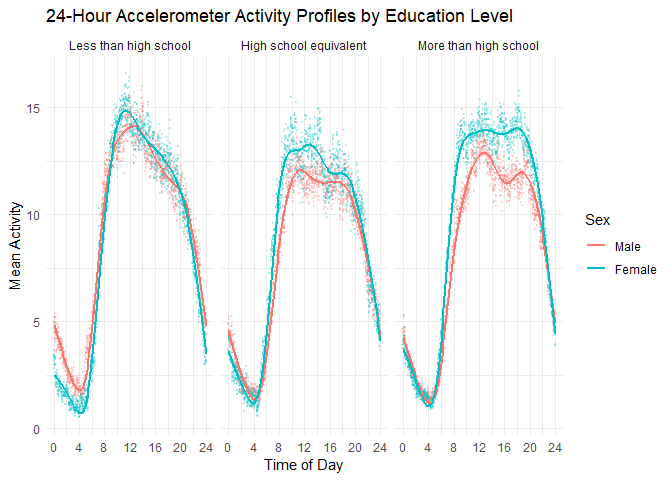

p8105_hw3_sx2402
================
Eric Xu
2025-10-04

## Problem 1:

``` r
instacart_skim = instacart |> 
  mutate(
    user_id = as.character(user_id),
    aisle_id = as.character(aisle_id),
    reordered = as.factor(reordered),
    order_id = as.character(order_id),
    product_id = as.character(product_id),
    department_id = as.character(department_id)
         )

names(instacart_skim)
skimr::skim(instacart_skim)
```

There are 1384617 observations from dataset `instacart` and 131,209
unique users. Each row represents a single product in a customer’s
order. There are in total 39123 unique product names. There are total 15
variables, 5 describing identifiers of order, aisle, product,
department, and user; and `add_to_cart_order` shows order in which each
product was added to cart.

Some other important variables include:

- `redordered`: if this product has been ordered by this user in the
  past
- `order_number`: the order sequence number for this user (1=first,
  n=nth)
- `order_dow`: the day of the week on which the order was placed
- `order_hour_of_day`: the hour of the day on which the order was placed
- `days_since_prior_order`: days since the last order, capped at 30, NA
  if order_number is 1

### Questions:

**How many aisles are there, and which aisles are the most items ordered
from?**

``` r
instacart_skim = instacart |> 
  summarize(
    n_aisle = n_distinct(aisle),
    n_obs = n()
    )
instacart_skim
## # A tibble: 1 × 2
##   n_aisle   n_obs
##     <int>   <int>
## 1     134 1384617

instacart_skim = instacart |>
  group_by(aisle) |> 
  count(aisle, name = "n_times") |> 
  arrange(desc(n_times))
instacart_skim
## # A tibble: 134 × 2
## # Groups:   aisle [134]
##    aisle                         n_times
##    <chr>                           <int>
##  1 fresh vegetables               150609
##  2 fresh fruits                   150473
##  3 packaged vegetables fruits      78493
##  4 yogurt                          55240
##  5 packaged cheese                 41699
##  6 water seltzer sparkling water   36617
##  7 milk                            32644
##  8 chips pretzels                  31269
##  9 soy lactosefree                 26240
## 10 bread                           23635
## # ℹ 124 more rows
```

*There are 134 unique aisles and aisle `fresh vegetables` occurred
150609 times with the the most items ordered from*

**Make a plot that shows the number of items ordered in each aisle,
limiting this to aisles with more than 10000 items ordered. Arrange
aisles sensibly, and organize your plot so others can read it.**

``` r
aisle_counts = instacart |> 
  count(aisle, name = "n_times") |> 
  filter(n_times > 10000)

aisle_counts |> 
  mutate(aisle = fct_reorder(aisle, -n_times)) |> 
  ggplot(aes(x = aisle, y = n_times)) +
  geom_bar(stat = "identity")+
   viridis::scale_color_viridis()+
  theme(axis.text.x = element_text(angle=90, size=9, hjust=1, vjust=0.5))+
  labs(
    title = "Number of items ordered by aisle",
    x = "Aisle",
    y = "Number of items ordered"
  )
```

<!-- --> Fresh vegetables
and fresh fruits has overwhelming purchase number across all aisles with
around 150000 and packaged vegetables and yogurt follows with around
50000 to 100000. This shows a high demand on healthy food and fresh
vegetable and fruits purchased in online grocery.

**Make a table showing the three most popular items in each of the
aisles “baking ingredients”, “dog food care”, and “packaged vegetables
fruits”. Include the number of times each item is ordered in your
table.**

``` r
top_items = instacart |> 
  filter(aisle %in% c("baking ingredients", "dog food care", "packaged vegetables fruits")) |> 
  count(aisle,product_name, name = "times") |>
  group_by(aisle) |> 
  arrange(desc(times)) |> 
  slice_max(times, n =3)
knitr::kable(top_items)
```

| aisle | product_name | times |
|:---|:---|---:|
| baking ingredients | Light Brown Sugar | 499 |
| baking ingredients | Pure Baking Soda | 387 |
| baking ingredients | Cane Sugar | 336 |
| dog food care | Snack Sticks Chicken & Rice Recipe Dog Treats | 30 |
| dog food care | Organix Chicken & Brown Rice Recipe | 28 |
| dog food care | Small Dog Biscuits | 26 |
| packaged vegetables fruits | Organic Baby Spinach | 9784 |
| packaged vegetables fruits | Organic Raspberries | 5546 |
| packaged vegetables fruits | Organic Blueberries | 4966 |

The most popular items for baking ingredients has around 300 too 500
times of purchase which are all common used ingredient;the three product
has low variation in purchase. The dog food care has less online
purchases with 26 to 30 that are has one snack and other two chicken and
rice favored;;the three product has low variation in purchase. For
vegetables, around 5000 to 10000 purchases for the first three product
that are all organic with 2 berries of similar purchases and baby
spinach with highest times ordered.

**Make a table showing the mean hour of the day at which Pink Lady
Apples and Coffee Ice Cream are ordered on each day of the week; format
this table for human readers (i.e. produce a 2 x 7 table).**

``` r
#extract and DOW transform
mean_hours = instacart |> 
  filter(product_name %in% c("Pink Lady Apples", "Coffee Ice Cream")) |> 
  group_by(product_name,order_dow) |> 
  summarize(
    mean_hour = mean(order_hour_of_day)
    ) |> 
  mutate(order_dow = case_when(
    order_dow == 0 ~ "Sunday",
    order_dow == 1 ~ "Monday",
    order_dow == 2 ~ "Tuesday",
    order_dow == 3 ~ "Wednesday",
    order_dow == 4 ~ "Thursday",
    order_dow == 5 ~ "Friday",
    order_dow == 6 ~ "Saturday"
  )) |> 
  pivot_wider(names_from = order_dow, values_from = mean_hour) |> 
  rename("Product Name" = "product_name")


knitr::kable(mean_hours, digits = 2)
```

| Product Name     | Sunday | Monday | Tuesday | Wednesday | Thursday | Friday | Saturday |
|:-----------------|-------:|-------:|--------:|----------:|---------:|-------:|---------:|
| Coffee Ice Cream |  13.77 |  14.32 |   15.38 |     15.32 |    15.22 |  12.26 |    13.83 |
| Pink Lady Apples |  13.44 |  11.36 |   11.70 |     14.25 |    11.55 |  12.78 |    11.94 |

The purchase time of Ice cream is on average late afternoon around 3pm
from Monday to Thursday as workdays. On Friday to Sunday with spare
time, the purchase time is more close to noon and the product seems to
be preferred as snack after lunch. The apple has a relatively earlier
purchase throughout the week and no significant difference in average
purchase time across all week that all are purchased around noon which
is center of time distribution showing not significant preference of
purchase time. While it can also relate to observations that healthier
snacks and staples tend to be purchased earlier in the day and Ice cream
and frozen pizza are the most frequently ordered products late at night.

## Problem 2

**Import Dataset**

``` r
zip_code = read_csv("./Data/Zip Codes.csv") |> 
  janitor::clean_names() |> 
  select(-file_date)

zori = read.csv("./Data/Zip_zori_uc_sfrcondomfr_sm_month_NYC.csv") |> 
  janitor::clean_names() |> 
  filter(region_type == "zip")|> 
  rename(
    zip_code = region_name,
    zori_county = county_name
         )|> 
  select(-region_type)

zori_long = zori |> 
  pivot_longer(x2015_01_31:x2024_08_31,
               names_to = "date",
               values_to = "zori",
               names_prefix = "x",
               )
zori_zip = left_join(zori_long,zip_code,by="zip_code",relationship = "many-to-many")
```

**How many ZIP codes are observed 116 times? How many are observed fewer
than 10 times? Why are some ZIP codes are observed rarely and others
observed in each month?**

``` r
zip_counts = zori_zip |> 
  filter(is.na(zori) == FALSE) |> 
  group_by(zip_code) |> 
  summarize(
    n_obs = n()
    )|> 
  filter (n_obs == 116 | n_obs<10)

#count
zip_counts |> 
  summarize(
    count1 = sum(n_obs == 116),
    count2 = sum(n_obs < 10)
  ) 
## # A tibble: 1 × 2
##   count1 count2
##    <int>  <int>
## 1     47     26

#filter obs
zori_counts = left_join(zip_counts,zori_zip, by = "zip_code") |> 
  filter(n_obs < 10 | n_obs == 116) |> 
  group_by(zip_code) |> 
  arrange(n_obs) |> 
  distinct(zip_code, zori_county, n_obs)
zori_counts
## # A tibble: 73 × 3
## # Groups:   zip_code [73]
##    zip_code zori_county     n_obs
##       <dbl> <chr>           <int>
##  1    10453 Bronx County        1
##  2    10470 Bronx County        1
##  3    11366 Queens County       1
##  4    11369 Queens County       1
##  5    11426 Queens County       1
##  6    11693 Queens County       1
##  7    10162 New York County     2
##  8    10303 Richmond County     2
##  9    10459 Bronx County        2
## 10    10460 Bronx County        2
## # ℹ 63 more rows
```

There are 47 ZIP codes observed 116 times and 26 fewer than 10 times.
The counties has little observation are relatively distinct and is
likely to be not rental or not residential so that not enough
observation and data can be collected through rental pricing. While the
zip codes observed every month are in majority of New York County and
Queens where rental is a general option and data is collected easity
with large amount of rental deals.

**Create a reader-friendly table showing the average rental price in
each borough and year (not month). Comment on trends in this table.**

``` r
#date to year
zori_zip_table = zori_zip |> 
  filter(!is.na(zori)) |> 
  mutate(
    date = as.Date(date, format = "%Y_%m_%d"),
    year = year(date)
  )

#average price
zori_zip_table = zori_zip_table |>  
  group_by(county, year) |> 
  summarize(
    avg_rent = mean(zori, na.rm = TRUE)
  ) |> 
  pivot_wider(
    names_from = year,
    values_from = avg_rent
  )


knitr::kable(zori_zip_table, digits = 1)
```

| county   |   2015 |   2016 |   2017 |   2018 |   2019 |   2020 |   2021 |   2022 |   2023 |   2024 |
|:---------|-------:|-------:|-------:|-------:|-------:|-------:|-------:|-------:|-------:|-------:|
| Bronx    | 1759.6 | 1520.2 | 1543.6 | 1639.4 | 1705.6 | 1811.4 | 1857.8 | 2054.3 | 2285.5 | 2496.9 |
| Kings    | 2492.9 | 2520.4 | 2545.8 | 2547.3 | 2630.5 | 2555.1 | 2549.9 | 2868.2 | 3015.2 | 3125.7 |
| New York | 3006.3 | 3014.6 | 3109.1 | 3159.7 | 3285.3 | 3091.3 | 3124.3 | 3753.1 | 3908.2 | 4052.8 |
| Queens   | 2214.7 | 2272.0 | 2263.3 | 2291.9 | 2387.8 | 2315.6 | 2210.8 | 2406.0 | 2561.6 | 2693.6 |
| Richmond |     NA |     NA |     NA |     NA |     NA | 1977.6 | 2045.4 | 2147.4 | 2332.9 | 2536.4 |

``` r
#check NA in Richmond
zori_zip |> 
  filter(
    county == "Richmond",
    !is.na(zori)
  ) |> 
  summarize(
    mindate = min(date),
    maxdate = max(date)
  )
```

    ## # A tibble: 1 × 2
    ##   mindate    maxdate   
    ##   <chr>      <chr>     
    ## 1 2020_08_31 2024_08_31

The average rental price increases by year from 2015 to 2024 across all
counties and with a slower increase in 2021 where pandemic reduces the
demand of rental. Also, Richmond has no information on rental untile
2020. The New York county has on average highest rental price and Bronx
has the lowest possibly due to resource, access, and safety concerns.

**Plotting Rental Prices within ZIP**

``` r
zori_zip_plot = zori_zip|> 
  mutate(
    date = as.Date(date, format = "%Y_%m_%d"),
    year = year(date)
         ) |> 
  select(zori, year, county,zip_code,date) |> 
  drop_na(zori)
zori_zip_plot_p =
  ggplot(zori_zip_plot,aes(x = date, y = zori, group = zip_code, color = county, na.rm = TRUE)) +
  geom_point(alpha = 0.4, size = 0.4)  +
  geom_line(alpha = 0.4, linewidth = 0.4)+
  facet_wrap(~ county, strip.position = "bottom", ncol = 1, nrow=5)+
  labs(
    title = "NYC Rental Prices by ZIP Code",
    x = "Year",
    y = "Average Rental Price")+
  scale_x_date(date_breaks = "3 years", date_labels = "%Y")
zori_zip_plot_p
```

<!-- -->

NYC rental prices have generally increased across all boroughs from 2015
to 2024, with a sharp drop in 2021 that aligns with the COVID-19 which
has impacted demand. After the pandemic, prices restored to original
place and continued to rise. Manhattan (New York County) consistently
has the highest rental levels and most available records zip codes,
while Brooklyn (Kings County) follows with moderately high prices.
Queens and the Bronx show lower but steadily increasing rents, and
Richmond (Staten Island) appears later in the data, after 2021, with
comparatively lower rental prices.

**Average Rental Price within each ZIP Plot**

``` r
zori_2023 = zori_zip |>
  mutate(
    date = as.Date(date, format = "%Y_%m_%d"),
    year = year(date),
    month = month(date)
    )|> 
  filter(year == 2023) |> 
  group_by(zip_code, county, month) |> 
  summarize(
    avg_rent = mean(zori, na.rm = TRUE),
    .groups = "drop"
  )

zori_2023_p = ggplot(zori_2023, aes(x = county, y = avg_rent)) +
  geom_violin(alpha = 0.6, aes(fill = county),color = "blue", na.rm = TRUE)+
  labs(
    title = "Monthly Rental Price by Zip",
    x = "County",
    y = "Average Monthly Rent"
  ) +
    theme(axis.text.x = element_text(angle = 45, hjust = 1))
zori_2023_p
```

<!-- -->

``` r
combined_plot =
  (zori_2023_p | zori_zip_plot_p)
combined_plot
```

<!-- -->

``` r
ggsave(filename = "./result/combined.png",plot = combined_plot, width = 15, height = 8, dpi = 300)
```

Manhattan (New York County) shows the highest average rental prices with
wide distribution with highest variation to 8000. Indicating both very
expensive priced max rental price and high minimum rental price among
all ZIP codes within the county. Brooklyn (Kings County) and Queens
follows, also with a narrower distribution generally lower than
Manhattan but higher than others. Richmond and the Bronx display lower
median rents and Richmond (Staten Island) has the narrowest
distribution, reflecting relatively limited variation due to little
sample.

## Problem 3

**Data Import**

``` r
covar = read_csv("./Data/nhanes_covar.csv",skip = 4) |> 
  janitor::clean_names()
accel = read_csv("./Data/nhanes_accel.csv")|> 
  janitor::clean_names()

covar_accel = left_join(covar,accel, by = "seqn") |> 
  filter(
    age>=21,
    !is.na(sex), 
    !is.na(age), 
    !is.na(education)
    ) |> 
  mutate(
    sex = factor(sex,
                 levels = c(1, 2),
                 labels = c("Male", "Female"),
                 ordered = FALSE),
    
    education = factor(education,
                       levels = c(1, 2, 3),
                       labels = c("Less than high school",
                                  "High school equivalent",
                                  "More than high school"),
                       ordered = TRUE)
  )
```

**Table and Plots**

``` r
knitr::kable(count(covar_accel, education, sex))
```

| education              | sex    |   n |
|:-----------------------|:-------|----:|
| Less than high school  | Male   |  28 |
| Less than high school  | Female |  29 |
| High school equivalent | Male   |  36 |
| High school equivalent | Female |  23 |
| More than high school  | Male   |  56 |
| More than high school  | Female |  59 |

Among the selected sample, the distribution of individual across each
education level is similar across sex, though there is more male in High
school equivalent level compared to female. There are overall more
individuals in More than high school education level compared to other 2
with less experience in school.

``` r
covar_accel |> 
  ggplot(aes(x = age,fill=sex))+
  geom_density(alpha = .3, adjust = .5)+
  geom_rug()+
  facet_grid(~education)+
  viridis::scale_fill_viridis(discrete = TRUE)
```

<!-- --> The plot shows
the age distribution of male and female across different education
levels. There is a wide spread range from 21 to 80. The male and female
density map overlaps generally in all three maps showing a relatively
stable distribution except for variation in 20-40 years old individuals
in High school equivalent level. Overall, the age distribution is
different in three groups where More than high school individuals are
more dense in younger ages and Less than high school groups are more
dense in elderly. For High school equivalent, there are more elderly
female while male has a generally averaged distribution across all ages.

``` r
accel_long <- covar_accel |> 
  pivot_longer(
    cols = starts_with("min"),
    names_prefix = "min",
    names_to = "minute", 
    values_to = "activity"
  ) |> 
  mutate(
    minute = as.numeric(minute),
    hour = minute / 60
  )

total_activity <- accel_long |> 
  group_by(seqn, age, sex, education) |> 
  summarize(
    total_activity = sum(activity, na.rm = TRUE),
    .groups = "drop"
  )

ggplot(total_activity, aes(x = age, y = total_activity, color = sex)) +
  geom_point(alpha = 0.6, size = 1) +
  geom_smooth(se = FALSE) +
  facet_wrap(~education) +
  labs(
    title = "Total Daily Accelerometer Activity vs Age by Education Level",
    x = "Age",
    y = "Total Daily Activity",
    color = "Sex"
  ) +
  theme_minimal() +
  viridis::scale_color_viridis(discrete = TRUE)
```

<!-- --> Daily physical
activity generally declines with age across all education levels. Female
show higher total activity than men across a majority of groups, except
for individuals over 60 in the Less than high school category, where men
show slightly higher activity. The decline in activity is higher in
scale among participants with lower educational attainment, likely
reflecting differences in SES, occupational demands, and retirement
patterns. In contrast, participants with higher education maintain
relatively higher activity levels, possibly due to greater health
awareness, access to resources, and structured leisure-time activities.
The variation of activity is high and the trend is created by smooth
function as an approximate estimate which may not be fitting the real
situation.

``` r
ggplot(accel_long, aes(x = hour, y = activity, color = sex)) +
  stat_summary(fun = "mean", geom = "point", size = 0.1, alpha = 0.2) +
  facet_grid(~education)+
  labs(title = "24-Hour Accelerometer Activity Profiles by Education Level",
       x = "Time of Day",
       y = "Mean Activity",
       color = "Sex") +
  scale_x_continuous(limits = c(0, 24),breaks = seq(0, 24, 4))+
  geom_smooth(se = FALSE, alpha = 0.5) +
  theme_minimal()
```

<!-- --> With the plot
of 24-hour mean activity of individuals over 21 years old, there is
clear diurnal rhythm activity and a peak of activity interval appears
around 9 until 20. In general, female performs higher mean activity by
accelerator measuring compared to male in mean value. This difference is
more significant for groups with higher education level that more
obvious in High School Equivalent level and most obvious in More than
high school level. Also, the average activity seems to fall shortly
after 12 which may due to lunch and rest. Also, smoother peaks can be
observed in higher education levels which can be due to SES and
occupations within stable environment. The variation can also arise from
the age distribution in sample since the variation would be large for
different stages in life.
